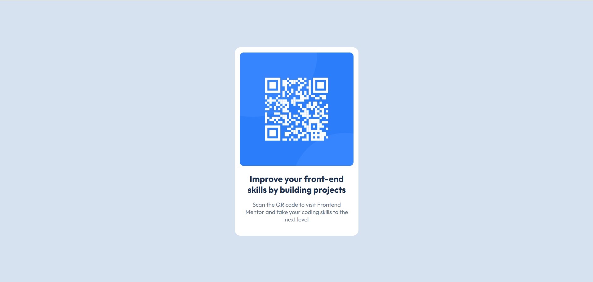

# Frontend Mentor - QR code component solution

This is a solution to the [QR code component challenge on Frontend Mentor](https://www.frontendmentor.io/challenges/qr-code-component-iux_sIO_H). Frontend Mentor challenges help you improve your coding skills by building realistic projects. 

## Table of contents

- [Overview](#overview)
  - [Screenshot](#screenshot)
  - [Links](#links)
- [My process](#my-process)
  - [Built with](#built-with)
  - [What I learned](#what-i-learned)

**Note: Delete this note and update the table of contents based on what sections you keep.**

## Overview

### Screenshot



### Links

- Solution URL: [https://www.frontendmentor.io/challenges/qr-code-component-iux_sIO_H](https://www.frontendmentor.io/challenges/qr-code-component-iux_sIO_H)
- Live Site URL: [Add live site URL here](https://your-live-site-url.com)

## My process

### Built with

- Semantic HTML5 markup
- CSS custom properties
- Flexbox
- Mobile-first workflow
- Google Fonts (Outfit)

### What I learned

From this project, i learned how to import url font family from google font

To see how you can add code snippets, see below:

```css
@import url('https://fonts.googleapis.com/css2?family=Outfit:wght@100..900&display=swap');
```

I've just completed a front-end coding challenge from @frontendmentor! 🎉

You can see my solution here: https://www.frontendmentor.io/solutions/responsive-landing-page-using-flexbox-UssZL_EAI3

Any suggestions on how I can improve are welcome!